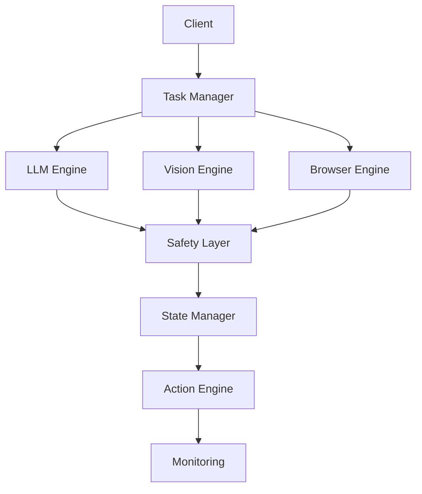

# Zigral 2.2

A modern, scalable AI agent framework with advanced monitoring, safety mechanisms, and multi-modal capabilities.

## Architecture Overview



## Core Components

### Task Management (`src/task/`)
- Task orchestration and lifecycle management
- Priority queuing and scheduling
- Resource allocation and constraints

### LLM Integration (`src/llm/`)
- Claude integration and prompt management
- Context handling and memory management
- Response processing and validation

### Vision Processing (`src/vision/`)
- Image analysis and processing
- OCR capabilities
- Visual content understanding

### Browser Automation (`src/browser/`)
- Playwright-based web interaction
- Session management
- Web content extraction

### Safety Mechanisms (`src/safety/`)
- Input validation and sanitization
- Output verification
- Action constraints and permissions
- Rate limiting and resource protection

### State Management (`src/state/`)
- Persistent state tracking
- Transaction management
- State validation and recovery

### Action Engine (`src/actions/`)
- Action execution framework
- Tool integration
- Result validation

### Monitoring (`src/monitoring/`)
- Prometheus metrics integration
- OpenTelemetry tracing
- Structured logging
- Performance monitoring

## Getting Started

1. Set up your environment:
   ```bash
   python -m venv .venv
   source .venv/bin/activate  # On Windows: .venv\Scripts\activate
   pip install -r requirements.txt
   ```

2. Configure your environment:
   - Copy `.env.example` to `.env`
   - Update the configuration values

3. Run the application:
   ```bash
   python -m src.main
   ```

## Development

### Prerequisites
- Python 3.11+
- Redis (for caching)
- PostgreSQL (for persistence)

### Testing
See [TESTING.md](TESTING.md) for detailed testing information.

### Monitoring
- Prometheus metrics available at `/metrics`
- Structured logs using `structlog`
- Trace visualization via OpenTelemetry

## Configuration

The system can be configured through:
1. Environment variables (see `.env.example`)
2. Configuration files (`config.json`)
3. Runtime configuration API

## Security

- All external inputs are validated and sanitized
- Rate limiting on API endpoints
- Resource usage monitoring and constraints
- Secure credential management

## License

Copyright © 2024 Zigral. All rights reserved. 